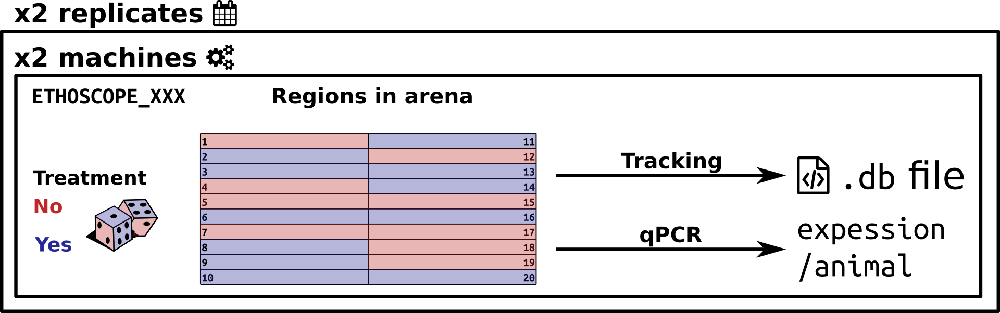

# Ethoscope data, in practice {#scopr -}


**Large data**

---------------------------


## Aims {-}
In this practical chapter, we will use a real experiment to learn how to:

* Translate your experiment design into a metadata file
* Use this metadata file to load some data
* Set the circadian reference (ZT0)
* Optimise your code to save time and RAM
* Assess graphically the quality of the data


## Prerequisites {-}

* You are familiar with the [Ethoscope Platform](http://gilestrolab.github.io/ethoscope/)
* Ensure you have read about the [rethomics workflow](workflow.html) and [metadata](metadata.html)
* Ensure you have [installed](intro.html#installing-rethomics-packages)
`behavr`, `scopr` and `ggetho` packages:


```{r, eval=FALSE}
library(devtools)
install_github("rethomics/behavr")
install_github("rethomics/scopr")
install_github("rethomics/ggetho")
```

```{r, echo=FALSE}
URL <- "https://zenodo.org/record/1068324/files/ethoscope_results.zip"
DATA_DIR <- paste(tempdir(), "ethoscope_tutorial", sep="/")
dir.create(DATA_DIR)
knitr::opts_knit$set(root.dir = DATA_DIR)

dst <- paste(DATA_DIR, "ethoscope_tutorial.zip", sep="/")
download.file(URL, dst)

unzip(dst, exdir= DATA_DIR)
```


## Background {-}

[The Ethoscope Platform](http://gilestrolab.github.io/ethoscope/) is a versatile and modular behavioural system to sudy behaviour of small animals. You can read more about it in our [PLOS Biology publication](http://journals.plos.org/plosbiology/article?id=10.1371/journal.pbio.2003026).
Although you can do much more with them, ethoscope are primarily designed to study sleep and circadian rhythms in Drosophila. 
Therefore, this tutorial targets mainly users in this context.

Ethoscopes typically generate hundreads of megabytes per machine per week.
The platform is designed so that many devices run an parallel, and the resulting data is eventually centralised for all users. 
**Metadata tables are the best way to both keep track of your expriments and fetch the relevant data.**


## Getting the data {-}
### Extract the zipped data {-}

Since ethoscopes generate **large amount of data**, compared to DAM, we will work only with a few animals.
A zip containing data for this tutorial is available on [zenodo](https://zenodo.org/record/1068324).

Start by downloading and extracting the zip somewhere in your computer.
Then, store this location as a variable. For example, **adapt** the path here:

```r{eval=F}
DATA_DIR <- "C://Where/My/Zip/Has/been/extracted
```

Check that all the files live there:

```{r}
list.files(DATA_DIR)
```

We have:

* The metadata file that I have prepared for you
* An `ethoscope_results` directory
 
### Note on the data structure {-}
It is informative to take a look at the latter.
Files are organised as `<machine_id>/<machine_name>/<datetime>/<file>`:


```
ethoscope_results
├── 008d6ba04e534be486069c3db7b10827
│   └── ETHOSCOPE_008
│       └── 2016-07-29_14-57-35
│           └── 2016-07-29_14-57-35_008d6ba04e534be486069c3db7b10827.db
├── 009d6ba04e534be486069c3db7b10827
│   └── ETHOSCOPE_009
│       └── 2016-07-22_16-43-29
│           └── 2016-07-22_16-43-29_009d6ba04e534be486069c3db7b10827.db
└── 011d6ba04e534be486069c3db7b10827
    └── ETHOSCOPE_011
        ├── 2016-07-22_16-41-21
        │   └── 2016-07-22_16-41-21_011d6ba04e534be486069c3db7b10827.db
        └── 2016-07-29_14-59-49
            └── 2016-07-29_14-59-49_011d6ba04e534be486069c3db7b10827.db
```

Tracking data are saved in `.db` files. 
Everytime an ethoscope is started, one new `.db` file is created.
All animals present in the same machine at the same time will have their data saved in the same `.db` file.
 
### Set your working directory {-}
For this tutorial, we will just [set our working directory](https://support.rstudio.com/hc/en-us/articles/200711843-Working-Directories-and-Workspaces) to `DATA_DIR`:

```{r, eval=FALSE}
setwd(DATA_DIR)
```


## From experiment design to metadata{-}

### Our toy experiment{-}

The data I gave you is from a real experiment, but for the sake of the tutorial, I have made up a story around it. It goes like that:

* We are interested in **the effect of a drug**, let's call it the "mystery drug", on **sleep and activity** in fruit flies
* We supect this drug acts indirectly by **inhibiting the expression of a (mystery) gene**

To address these two questions, we have delivered a **drug** (yes or no) to fruit flies, and **randomised** their position in **two ethoscopes**. 
We then acquiered individual data (e.g. position and activity) about **twice a second for several days**.
We performed **two replicates**, one week appart.
In addition, in the end of the experiment, we also collected flies and **measured the relative expression of our candidate gene**.

Ultimatly, we would like to:

* Analyse the effect of the drug on sleep
* Study the correlations between the activity (or the drug) and the level of transcript
<!-- * Account for the replication design (aka [random effect](https://en.wikipedia.org/wiki/Random_effects_model)) -->





### Metadata {-}

**It is crucial that you have read [metadata chapter](metadata.html)** to understand this part.
Our goal is to encode our whole experiment in a single file in which:

* each row is an individual
* each column is a metavariable

Luckily for you, I have already put this file together for you as `metadata.csv`!
Lets have a look at it (you can use `R`, excel or whatever you want). 
If you are using `R`, type this commands:

```{r}
library(scopr)
metadata <- fread("metadata.csv")
metadata
```

Each of the 80 animals (rows) is defined by two mandatory columns (metavariables):

* `machine_name` -- the name of the device used (e.g. `"ETHOSCOPE_001"`)
* `date` -- the date and time (`YYYY-MM-DD`) of the start of the experiment
* `region_id` -- The tube (region of interest) in which an animal was tracked ([1,20])


We defined also custom columns (i.e. metavariables). Note that you could define many, with arbitrary names:

* `treatment` -- "yes" or "no", whether the drug was administered
* `replicate` -- 1 or 2, firth or second replicate
* `expression_level` -- a continuous number [0, +Inf], how much a candidate gene is transcribed


**Importantly, you should be able to understand the experiment**, and describe each animal, **from the metadata file**.


## Linking{-}

[Linking](metadata.html#linking-metadata) is the one necessary step before loading the data.
It **allocates a unique identifier to each animal**. In addition, it finds the file needed to load its data.

###  Local data {-}

If your data is already in your computer (as it is now sice you have downloaded it manually),
you can simply link it like:

```{r}
metadata <- link_ethoscope_metadata(metadata, 
                                    result_dir = "ethoscope_results")
print(metadata)
```


### Remote Data {-}

In real life situations, when several experimenters are working in parallel,
Users should not:

* Have to download all the data from all users at all time (very inefficient)
* Download data by hand from a server (error prone and time consuming)

Instead, it will be more common that all the data is stored on an **FTP** server (i.e. a network drive).
`scopr` allows us to look up in the metadata and download, incrementally, only the files needed.
For more information about how to set up network backups check the [ethocope documentation](https://qgeissmann.gitbooks.io/ethoscope-manual/administration-and-maintenance/backing-up-data.html).

In this context, we will be using `link_ethoscope_metadata_remote`.
It works almost exactly like `link_ethoscope_metadata`, but takes a `remote_dir` argument.
`remote_dir` is generally the address to an FTP directory.

This is just an example that you will have to **adapt to your own situation**:

```{r, eval=FALSE}
REMOTE_DIR <- "ftp://my-share-drive.com/where/the-data/lives"
RESULT_DIR <- "/where/to/save/the/data" 

metadata <- link_ethoscope_metadata_remote(metadata,
                                      remote_dir =  REMOTE_DIR,
                                      result_dir = RESULT_DIR,
                                      verbose = TRUE)
```

Note that, as long as you have an internet connection, you can use this function to link your metadata.
It will not download data files everytime (unless new data is available upstream).

## Loading{-}
The core fucntion of `scopr` is `load_ethoscope()`.
It is quite flexible and we will show here just a few examples of how to use it.
**Do have a look at the documentation** (e.g. by running `?load_ethoscope`), if you want to know more.


### Raw data (default) {-}

The simplest thing one can do is to load **all tracking data**.
However, this comes with several caveats:

* A lot (gigabytes) of data will be needed
* You will probably have to process the data immediatly after in order to extract biological meaning

Here, we will just load data from animals in region 1 (metadata[region_id == 1]).
As it is could otherwise be too much data:

```{r, cache=TRUE}
metadata_subset <- metadata[region_id == 1]
dt <- load_ethoscope(metadata_subset, verbose=FALSE)
summary(dt)
```
Note that I set `verbose` to `FALSE`. This is to avoid printing progress.
You may want to set it to `TRUE` (the default), so you can check how fast data loading is happening.

It is also good practice to print your resutling behavr table (`dt` in this case):
```{r}
print(dt)
```

It shows us the metadata as well as the first few and last few lines of actual data.
In the data, there are columns such as `x` and `y` that record position, but also others that may not make immediate sense to you.
**In practice, loading raw data is rare** for long experiments, and I would recommend doing it **only for prototyping** and such.
 
### Preprocessing {-}
As dissussed before, it is inneficient and not always possible to load all raw data for hundreads of animals.
Instead, we can **preprocess data on the go**.
In the context of activity and sleep analysis, we can quantified activity in windows of 10s ([techinical details here](http://journals.plos.org/plosbiology/article/file?type=supplementary&id=info:doi/10.1371/journal.pbio.2003026.s005)).
This is implemented in the function `sleep_annotation` of our `sleepr` package.
Ensure you have installed `sleepr` as well (`devtools::install_github("rethomics/sleepr")`).

When running this function:

* The activity in each 10s of data will be scored
* The position will be kept
* Sleep will be scored according to the "five minute rule"

To apply a function to **all individual data, as they are loaded**, we can use the `FUN` argument:

```{r, cache=TRUE}
dt <- load_ethoscope(metadata,
					   FUN = sleepr::sleep_annotation, 
					   verbose=FALSE)
summary(dt)
```

Again, we have a look at the resulting table:

```{r}
print(dt)
```

We have several variables (see in the  `===DATA===` section of the output).
The important ones are:

* `t` -- the time, in s, sample eveyr 10s
* `x` -- the position in the tube (0 = left, 1=right)
* `beam_cross` -- how many times the midline was crossed within the 10s window
* `moving` -- whether any movement was detected in this time window
* `asleep` -- whether the animal is asleep during this 10s (5min rule)

Note that you can use other functions than `sleep_annotation` (this is just an example) and even define your own!

### ZT0 {-}

By default, **the time is expressed relative to the onset of the experiment**.
In other words, $t_0$ is when you click on the "start tracking" button.
In the context of sleep, we care more about time **within a day**.
Therefore, we express time relative to ZT0 (i.e the hour of the day when the L phase starts).
In our lab, it is at **09:00:00, GMT**.
In `load_ethoscope`, we translate that by using the argument `reference_hour=9.0`:

```{r,eval=FALSE}
dt <- load_ethoscope(metadata,
             reference_hour=9.0, 
					   FUN = sleepr::sleep_annotation, 
					   verbose=FALSE)
```


### Cache directory {-}

One issue with loading ethoscope data is thta it is **relativelly slow**.
For instance, according to our computer, you may take half an hour to load data from 500 animals $times$ 1 week.
In your daily life, you will often need to close `R` and open it again later to analyse things differently, or simply change simple parameters on some figures. 
You really don't want to spend too long reloading data this sort of situation.

To address this issue, `load_ethoscope` comes with a [caching](https://en.wikipedia.org/wiki/Cache_(computing)) option.
When turned on, whenever you load any data, it stores a snapshot on the disk (in a directory you pick). 
Then, the *next time* you load the data, loading happends directly from the snapshot.
This way you will load data one or two orders of magnitudes faster!

The first time, everything will take as long:

```{r, cache=TRUE}
system.time(
  dt <- load_ethoscope(metadata,
             reference_hour=9.0, 
					   FUN = sleepr::sleep_annotation, 
             cache = "ethoscope_cache", 
					   verbose=FALSE)
)
```

However, the next time, we do the same thing way faster:

```{r, cache=TRUE}
system.time(
  dt <- load_ethoscope(metadata,
             reference_hour=9.0, 
					   FUN = sleepr::sleep_annotation, 
             cache = "ethoscope_cache", 
					   verbose=FALSE)
)
```

Here, we set `cache` to `"ethoscope_cache"`.
This creates a new directory called `"ethoscope_cache"` (you can pick the name and location you want).
If you to do a bit of tidying up, you can remove it without risk (it will just take time next time you load your data). 

## Quality control {-}

One way to check everything is in order with our data is to visualise it with a **tile plot**.
For instance, here, the variable `asleep`, for each animal (rows in the plot) over time (columns):

```{r, fig.width = 9, fig.height=16}
library(ggetho)
ggetho(dt, aes(z=asleep)) +
      stat_tile_etho() +
      stat_ld_annotations()
```

This allows us to spot possible outliers/missing data/artefacts and try to understand what to do whith them.
More about tiles plots in the [visualisation chapter](ggetho.html).

## And then? {-}

Just a teaser to show you how we can already work on our biological question at this stage,

### Sleep amount vs treatment {-}

We can start to see that *treatment increases sleep*:
```{r}
library(ggetho)
ggetho(dt, aes(y=asleep, colour=treatment), time_wrap = hours(24)) +
      stat_pop_etho() +
      stat_ld_annotations()
```


### Total sleep vs expression level {-}

First we [summarise](behavr.html#summerise-data) the total proportion of time spent sleeping for each animal (i.e. by id).
```{r}
summary_dt <- dt[, .(sleep_fraction = mean(asleep)), by=id]
```

Then we rejoin this summary to metadata:
```{r}
summary_dt <- rejoin(summary_dt)
summary_dt
```


This is a standard data.table (data.frame), so we can use it for some regular `R` magic.
We can show the how **sleep fraction and expression level are decorrelated**

```{r}
ggplot(summary_dt, aes(x=expression_level,
                       y=sleep_fraction,
                       colour = treatment)) +
  geom_point() +
  geom_smooth(method="lm")
```

## Next steps {-}

* [Visualise data with `ggetho`](ggetho.html)
* [Sleep analysis with `sleepr`](sleepr.html)
* [Circadian analysis with `zeitgebr`](zeitgebr.html)
