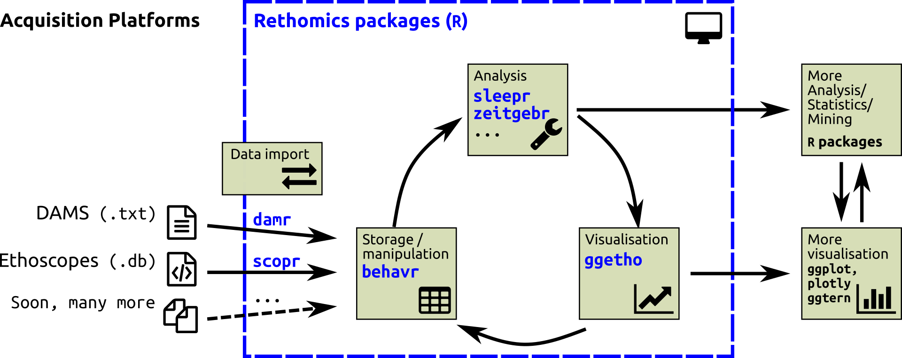

--- 
title: "Rethomics, a framework for high-throughput behaviour analysis in R"
author: "Quentin Geissmann"
date: "`r Sys.Date()`"
site: bookdown::bookdown_site
output: bookdown::gitbook
documentclass: book
bibliography: [book.bib, packages.bib]
biblio-style: apalike
link-citations: yes
github-repo: rstudio/bookdown-demo
description: "This is a tutorial for Rethomics, a framework to analyse high-throuput behavioural data in `R`."
---

# Introduction{-}

**Only if we share a common data structure can we use a common set of tools**

--------------------

In the last few years, there has been growing interests in *ethomics* -- that is, the analysis of large behavioural data sets.
Many software and hardware solutions have been proposed to record different behavioural variables
on several model organisms.
Although subsequent analysis and visualisation share many similarities,
each method tends to provide its own output format and, in practice, its own restricted analysis software.
This results in a lot of replicated work but also limits extension and collaboration.

Rethomics attempts to unify analysis of behaviour by providing several packages:

* `behavr` tables -- a  flexible and **universal structure** to handle very large behavioural data sets
* `damr`, `scopr`, … -- to **load data** from [DAMS](http://www.trikinetics.com/), [ethoscopes](gilestrolab.github.io/ethoscope) and others into `behavr` tables
* `ggetho` -- based on `ggplot2`, to produce **high-quality representations**  of behavioural data
* `sleepr`, `zeitgebr`, … -- to **analyse behavioural data** (sleep analysis, circadian rhythm, …)

This document is a tutorial intended for experimenters as well as data analysts.
It provides a suite of both **conceptual explanations** and very **concrete examples**.
